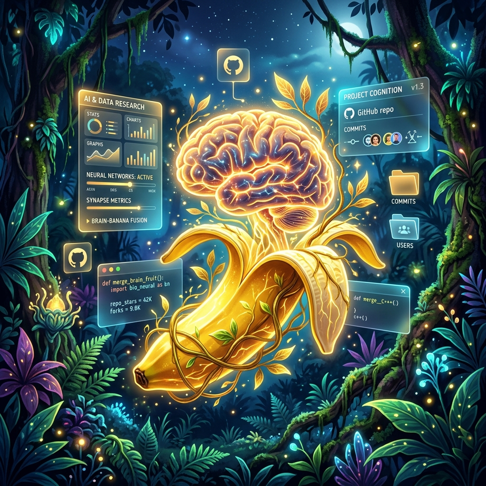

# 🍌 Banana Brain Quest 🧠

<div align="center">
  <a href="https://uob-game.netlify.app/">
    
  </a>
</div>

<div align="center">
  <h3>🌟 Play the Live Game: <a href="https://uob-game.netlify.app/">https://uob-game.netlify.app/</a> 🌟</h3>
</div>

<p align="center">
  
  
  
</p>

Welcome to **Banana Brain Quest**, a premium, competitive math puzzle game built with a stunning jungle/gold glassmorphism aesthetic! Test your pattern recognition, compete against friends in real-time, and climb the ranks from *Novice* to *Banana God*!

---

## 📂 Project Structure

```text
CIS046-3-Software-For-Enterprise-Project/
│
├── frontend/                # React.js & Vite Client
│   ├── src/
│   │   ├── api/             # Axios API interconnectors
│   │   ├── components/      # Reusable UI elements
│   │   ├── context/         # Auth & Global State providers
│   │   ├── pages/           # Core App Routes (Game, Admin, Profile, Login)
│   │   └── utils/           # Helper functions & socket setup
│   └── package.json
│
├── backend/                 # Node.js & Express Server
│   ├── controllers/         # Core business logic & endpoints
│   ├── models/              # Mongoose DB schemas
│   ├── routes/              # Express API Routes
│   └── server.js            # Entry Point & Socket.io handling
│
└── Testing/                 # 🤖 Playwright E2E Suite
    ├── playwright.config.js # Responsive Emulation settings
    └── tests/               
        ├── admin.spec.js    # Secure dashboard routing tests 
        ├── auth.spec.js     # Login & Registration UI logic tests 
        ├── gameplay.spec.js # Core game engine & websocket tests 
        ├── player.spec.js   # Private Profile/History tracking 
        └── public.spec.js   # Responsive Home & Leaderboard layout tests
```

---

## ✨ Features

### 🎮 **Stunning Game Modes**
* **Solo Arcade Console**: A breathtaking, unified glassmorphism dashboard. Face infinite puzzles, race against the timer, and try to beat your high score.
* **Real-Time Multiplayer**: Compete head-to-head against other players! Features a synchronized timer, live VS dashboard, and instant win/loss condition tracking via Socket.io.

### 🏆 **Deep Gamification & Progression**
* **XP & Ranking System**: Earn XP for solving puzzles and completing objectives. Level up through 10 distinct ranks.
* **Badges & Achievements**: Unlock unique badges for reaching milestones like "First Win" or "Speed Demon".

### 📊 **Competitive Tracking & E2E Testing**
* **Global Leaderboards**: See where you rank among all players.
* **Automated Playwright Suite**: 100% End-to-End coverage testing responsive flows (Mobile/Desktop) on every single page.

---

## 🚀 Getting Started Locally

### Prerequisites
* Node.js (v16+) & MongoDB

### 1. Start the Backend
```bash
cd backend
npm install
npm run dev
```

### 2. Start the Frontend
Open a new terminal window:
```bash
cd frontend
npm install
npm run dev
```

### 3. Run E2E Tests
To launch the automated test robots against your UI:
```bash
cd Testing
npx playwright test --ui
```

---

## 🎯 How to Play
1. Go to **[https://uob-game.netlify.app](https://uob-game.netlify.app)**
2. Choose a difficulty (Easy, Medium, Hard).
3. Look at the visual puzzle and figure out the missing single digit (`0-9`).
4. Enter your answer and smack the **🦍 GO BANANAS!** button.
5. Don't run out of lives (🧠) and beat the timer (⏱)! 
